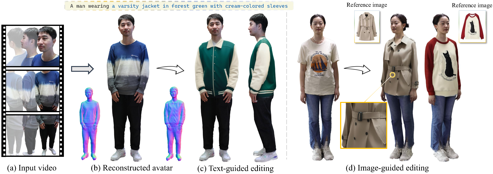

<h1 align="center">Creating Your Editable 3D Photorealistic Avatar with Tetrahedron-constrained Gaussian Splatting</h1>

<p align="center"></p>

Personalized 3D avatar editing holds significant promise due to its user-friendliness and availability to applications such as AR/VR and virtual try-ons. Previous studies have explored the feasibility of 3D editing, but often struggle to generate visually pleasing results, possibly due to the unstable representation learning under mixed optimization of geometry and texture in complicated reconstructed scenarios. In this paper, we aim to provide an accessible solution for ordinary users to create their editable 3D avatars with precise region localization, geometric adaptability, and photorealistic renderings. To tackle this challenge, we introduce a meticulously designed framework that decouples the editing process into local spatial adaptation and realistic appearance learning, utilizing a hybrid Tetrahedron-constrained Gaussian Splatting (TetGS) as the underlying representation. TetGS combines the controllable explicit structure of tetrahedral grids with the high-precision rendering capabilities of 3D Gaussian Splatting and is optimized in a progressive manner comprising three stages: 3D avatar instantiation from real-world monocular videos to provide accurate priors for TetGS initialization; localized spatial adaptation with explicitly partitioned tetrahedrons to guide the redistribution of Gaussian kernels; and geometry-based appearance generation with a coarse-to-fine activation strategy. Both qualitative and quantitative experiments demonstrate the effectiveness and superiority of our approach in generating photorealistic 3D editable avatars.

## 🚧 TODO
- [x] Release text-guided editing code
- [ ] Release reference image-guided editing code 
- [ ] Support custom data processing

## 📦 Installation
Our code has been tested on RTX A40 and RTX A6000 with CUDA 11.7.

```bash
conda create -n editable_avatar python==3.9
conda activate editable_avatar
pip3 install torch==2.0.1 torchvision==0.15.2 torchaudio==2.0.2 --index-url https://download.pytorch.org/whl/cu117

# dependencies
pip install -r requirements.txt

# install gaussian splatting
cd Edit_core/thirdparties/diff-gaussian-rasterization/
pip install -e .
cd ../simple-knn/
pip install -e .
cd ../../../

# install kaolin
pip install kaolin==0.17.0 -f https://nvidia-kaolin.s3.us-east-2.amazonaws.com/torch-2.0.1_cu117.html
```

## 🤖 Prepare Pretrained Models

Download [normal-adapted-sd1.5]((https://huggingface.co/xanderhuang/normal-adapted-sd1.5/tree/main)) from  for spatial adaptation.

Download [controlnet-union-sdxl-1.0-promax](https://huggingface.co/xinsir/controlnet-union-sdxl-1.0), [sdxl-vae-fp16-fix](https://huggingface.co/madebyollin/sdxl-vae-fp16-fix), [stable-diffusion-xl-base-1.0](https://huggingface.co/stabilityai/stable-diffusion-xl-base-1.0) for texture generation.

Put the models under the folder ```./pretrained_models```, the data structure should be like this:

```
pretrained_models/
├── controlnet-union-sdxl-1.0-promax/
├── normal-adapted-sd1.5/ 
├── sdxl-vae-fp16-fix/
├── stable-diffusion-xl-base-1.0/
```

## 💽 Download data
Download our [pre-processed data](https://drive.google.com/drive/folders/1gj-eBSEicgUGUT_9KwKJLsxEuyo_FOKq?usp=sharing) and put them under ```data``` folder, following the structure as ```./data/man```, etc.
Besides, download [512_tets.npz](https://drive.google.com/drive/folders/1gj-eBSEicgUGUT_9KwKJLsxEuyo_FOKq?usp=sharing) and put it under ```Edit_core/load/tets```.

## 🏋️‍♂️ Training

### Text-guided editing
For text-guided 3D avatar editing, run
```bash
bash run.sh
```
After training, the final edited renderings can be found in ```Edit_core/outputs/CASE_NAME/refined/validation_refine```

## 📚Acknowledgement

Our project benefits from the amazing open-source projects, we are grateful for their contribution!

- [HumanNorm](https://github.com/xhuangcv/humannorm)
- [gaussian-splatting](https://github.com/graphdeco-inria/gaussian-splatting)
- [SuGaR](https://github.com/Anttwo/SuGaR)
- [sdfstudio](https://github.com/autonomousvision/sdfstudio)

## 📜 Citation

If you find this work helpful, please consider citing our paper:

```bibtex
@misc{2504.20403,
Author = {Hanxi Liu and Yifang Men and Zhouhui Lian},
Title = {Creating Your Editable 3D Photorealistic Avatar with Tetrahedron-constrained Gaussian Splatting},
Year = {2025},
Eprint = {arXiv:2504.20403},
}